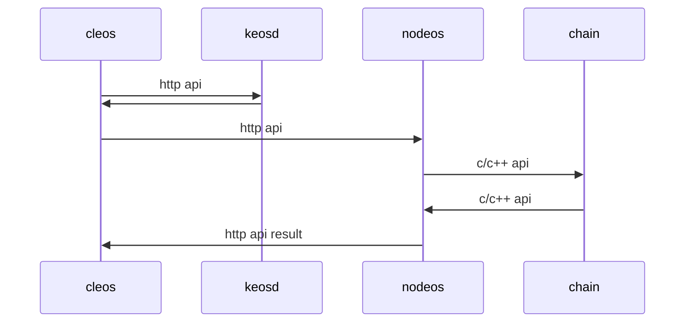

# HTTP API

## 说明
eos提供了C++实现的官方程序:
- 节点运行程序：nodeos
- 命令行客户端：cleos
- 钱包管理器：keosd

为更方便使用或是实现更丰富的功能，开发者可以根据http api接口实现自己的客户端。

eosforce实现的PC钱包提供了本地钱包，区块链浏览器，可视化的合约操作(转账、投票、分红等)。代替了cleos与keosd。

## HTTP API 调用流程



## HTTP API 文档

- [chain api](zh-cn/eosforce_http_chain_api.md)
- [history api](zh-cn/eosforce_http_history_api.md)

## HTTP API 调用具体说明

首先获取提供开放http接口调用的节点(域名或IP端口)。HTTP接口调用使用POST方式。
通过HTTP API 文档获取所需接口url，所需参数使用json格式通过body传入。

查询信息类接口比较简单，看文档说明即可。
除了查询信息外，对区块链的所有操作，都是通过执行智能合约的action实现。

### eosforce提供的智能合约包括:
- [System](zh-cn/contract/System/System.md) 系统合约：投票、分红等
- eosio.token 代币合约：token的创建、发行、转账等
- [eosio.bios](zh-cn/eosforce_account.md)(稍后开放) 内部合约：操作用户权限等
- [eosio.msig](zh-cn/contract/eosio.msig/msig.md)(稍后开放) 多重签名合约

> eosforce 目前暂未开放用户提交智能合约的功能

### action操作的执行流程：

1. 构造action: 指定合约账户，action名，执行权限
2. 设置action执行数据data字段：数据需序列化打包(可调用/v1/chain/json_to_bin转换接口，或根据abi本地实现序列化逻辑)
3. 构造transaction：包含action, 相应手续费，引用区块等信息
4. 对交易transaction进行签名
5. 调用 /v1/chain/push_transaction 接口，提交签名后的transaction数据。

> newaccount操作使用json_to_bin接口序列化失败问题已修复，稍后发布。可临时使用eos官方节点的接口
> eosforce transaction中只能包含一个action

### 安全性建议
执行操作应该至少判断 2/3 个BP节点确认(即不可逆)才能告诉用户执行成功。
可以通过轮询节点，返回不可逆区块信息再提示成功，具体技术过程如下：

1. push_transaction 后会得到 trx_id
2. 请求接口 POST  /v1/history/get_transaction
   ```json
    {
        "id": "100004bf44d5cc60fe0697b37de830809bef3c2fa0438c38705992f649b97eb6",
        "trx": null,
        "block_time": "2018-07-01T08:32:09.000",
        "block_num": 264171,
        "last_irreversible_block": 264171,
        "traces": []
    }
   ```
3. 返回参数中 block_num 小于等于 last_irreversible_block 即为不可逆