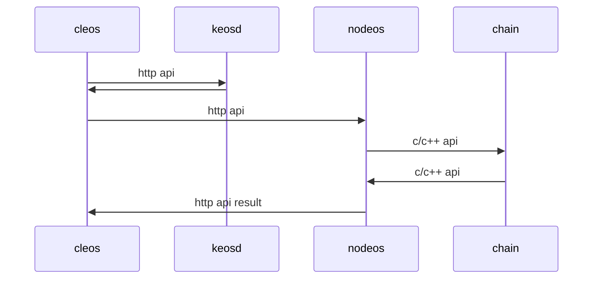

# HTTP API

## Introduction
eos provides official programs written in C++:
- node：nodeos
- client：cleos
- wallet manager：keosd

Developpers can develop their own client by calling http API for ease of use or rich functionality.

eosforce's PC wallet provides local wallet，blockchain explorer，visual operations(transfer、vote、reward etc) replacing cleos and keosd.

## HTTP API calling process



## HTTP API 

- [chain api](zh-cn/eosforce_http_chain_api.md)
- [history api](zh-cn/eosforce_http_history_api.md)

## HTTP API description

First get the nodes that provide HTTP interface(domain or IP)。HTTP interface uses POST mode。
Get the required interface URL through HTTP API document, and the required parameters are passed in through body using JSON format
.

The interface for querying informaton is simple，please refer to document。
In addition to querying information, all operations on block chains are implemented by executing smart contract actions.。

### eosforce's smart contracts provided include:
- [System](en-us/contract/System/System.md) ：system contracts, voting、rewarding etc
- eosio.token：create、issue、transfer of tokens
- [eosio.bios](en-us/eosforce_account.md) ：internal contracts, update user permissions etc.
- [eosio.msig](en-us/contract/eosio.msig/msig.md) multiple signature contracts

### action execution process：

1. construct action: specify contract account，action，permission
2. set action's data field：data needs t be packed(by calling /v1/chain/json_to_bin interface or serialize locally according to abi)
3. construct transaction：including action, fees，reference block etc.
4. sign the transaction
5. calling /v1/chain/push_transaction interface，submit the transaction。

> eosforce transaction can only include one action

### Security suggestion
At least 2/3 BP node validation (i.e. irreversibility) should be judged to tell the user that the operation was successful.
Through polling nodes, the irreversible block information can be returned to prompt for success. The specific technical process is as follows.
：

1. Get the trx_id after caling push_transaction
2. Calling the interface POST  /v1/history/get_transaction
   ```json
    {
        "id": "100004bf44d5cc60fe0697b37de830809bef3c2fa0438c38705992f649b97eb6",
        "trx": null,
        "block_time": "2018-07-01T08:32:09.000",
        "block_num": 264171,
        "last_irreversible_block": 264171,
        "traces": []
    }
   ```
3. Block_num less than or equal to last_irreversible_block in the return parameter is irreversible
