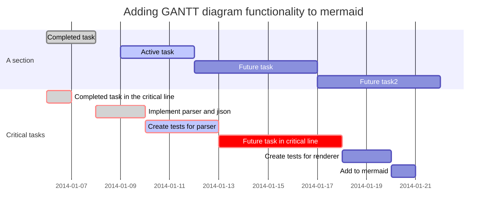
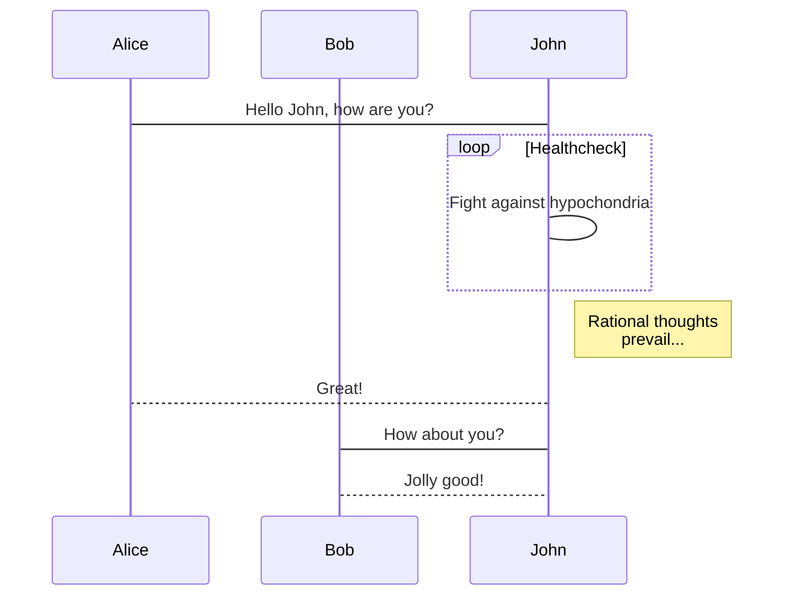
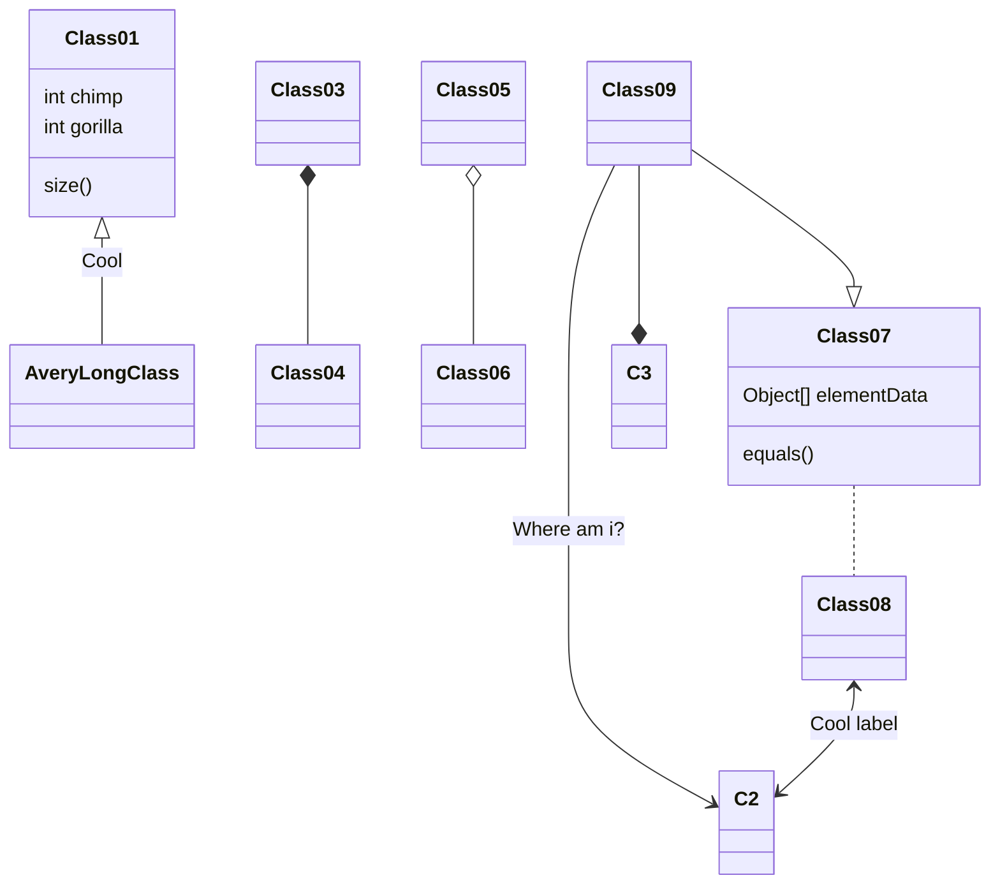

# Markdown 简明语法手册

---

## 基本语法

### 1. 斜体和粗体

使用 \* 和 ** 表示斜体和粗体。

示例：

```markdown
这是 *斜体*，这是 **粗体**。
```

这是 *斜体*，这是 **粗体**。

### 2. 分级标题

使用 === 表示一级标题，使用 --- 表示二级标题。

示例：

```markdown
这是一个一级标题
============================

这是一个二级标题
--------------------------------------------------

### 这是一个三级标题
```

你也可以选择在行首加井号表示不同级别的标题 (H1-H6)，例如：# H1, ## H2, ### H3，#### H4。

### 3. 外链接

使用 \[描述](链接地址) 为文字增加外链接。

示例：

```markdown
这是去往 [eosforce](https://www.eosforce.io/) 的链接。
```

这是去往 [eosforce](https://www.eosforce.io/) 的链接。

这是一个内部文档的连接：

```markdown
[常用公式示例](/examples/Example_math)
```

[常用公式示例](/examples/Example_math)

```markdown
[连接到位置](/examples/Example?id=_8-代码块)
```

[连接到位置](/examples/Example?id=_8-代码块)


### 4. 无序列表

使用 *，+，- 表示无序列表。

示例：

```markdown
- 无序列表项 一
- 无序列表项 二
- 无序列表项 三
```

- 无序列表项 一
- 无序列表项 二
- 无序列表项 三

### 5. 有序列表

使用数字和点表示有序列表。

示例：

```markdown
1. 有序列表项 一
2. 有序列表项 二
3. 有序列表项 三
```

1. 有序列表项 一
2. 有序列表项 二
3. 有序列表项 三

### 6. 强调内容

使用 > 表示强调内容。

示例：

```markdown
> 野火烧不尽，春风吹又生。
```

> 野火烧不尽，春风吹又生。

警告：

```markdown
!> 警告 这是一个警告
```

!> 警告 这是一个警告

普通提示:

```markdown
?> _TODO_ 完善示例
```

?> _TODO_ 完善示例


### 7. 行内代码块

使用 \`代码` 表示行内代码块。

示例：

```markdown
让我们聊聊 `html`。
```

让我们聊聊 `html`。

### 8.  代码块

使用 四个缩进空格 表示代码块。

示例：

    这是一个代码块，此行左侧有四个不可见的空格。

### 9.  插入图像

使用 \!\[描述](图片链接地址) 插入图像。

示例：

```markdown

```


# 高阶语法

-----------------------------------------

### 1. 删除线

使用 ~~ 表示删除线。

```markdown
~~这是一段错误的文本。~~
```

~~这是一段错误的文本。~~

### 2. LaTeX 公式

$ 表示行内公式： 

```markdown
质能守恒方程可以用一个很简洁的方程式 $E=mc^2$ 来表达。
```

质能守恒方程可以用一个很简洁的方程式 $E=mc^2$ 来表达。

```$$``` 表示整行公式：

```markdown
$$\sum_{i=1}^n a_i=0$$

$$f(x_1,x_x,\ldots,x_n) = x_1^2 + x_2^2 + \cdots + x_n^2 $$
```

$$\sum_{i=1}^n a_i=0$$

$$f(x_1,x_x,\ldots,x_n) = x_1^2 + x_2^2 + \cdots + x_n^2 $$

访问 [MathJax](http://meta.math.stackexchange.com/questions/5020/mathjax-basic-tutorial-and-quick-reference) 参考更多使用方法。

[一些例子](http://colobu.com/2014/08/17/MathJax-quick-reference/)

[常用公式示例](/examples/Example_math)

### 3. 加强的代码块

支持编程语言的语法高亮的显示，行号显示。

非代码示例：

```bash
$ sudo apt-get install vim-gnome
```

Python 示例：

```python
@requires_authorization
def somefunc(param1='', param2=0):
    '''A docstring'''
    if param1 > param2: # interesting
        print 'Greater'
    return (param2 - param1 + 1) or None

class SomeClass:
    pass

>>> message = '''interpreter
... prompt'''
```

JavaScript 示例：

``` javascript
/**
* nth element in the fibonacci series.
* @param n >= 0
* @return the nth element, >= 0.
*/
function fib(n) {
  var a = 1, b = 1;
  var tmp;
  while (--n >= 0) {
    tmp = a;
    a += b;
    b = tmp;
  }
  return a;
}

document.write(fib(10));
```

### 9. Mermaid甘特图



#### 更多语法参考：[图语法参考](https://knsv.github.io/mermaid/)
#### 工具 [live Editor](https://mermaidjs.github.io/mermaid-live-editor/#/edit/eyJjb2RlIjoiZ3JhcGggVERcbkFbQ2hyaXN0bWFzXSAtLT58R2V0IG1vbmV5fCBCKEdvIHNob3BwaW5nKVxuQiAtLT4gQ3tMZXQgbWUgdGhpbmt9XG5DIC0tPnxPbmV8IERbTGFwdG9wXVxuQyAtLT58VHdvfCBFW2lQaG9uZV1cbkMgLS0-fFRocmVlfCBGW2ZhOmZhLWNhciBDYXJdXG4iLCJtZXJtYWlkIjp7InRoZW1lIjoiZGVmYXVsdCJ9fQ)

### 10. Mermaid 流程图


### 11. Mermaid 序列图



### 12. Mermaid 类图



### 13. Mermaid git图


### 12. 表格支持

| 项目        | 价格   |  数量  |
| --------   | -----:  | :----:  |
| 计算机     | \$1600 |   5     |
| 手机        |   \$12   |   12   |
| 管线        |    \$1    |  234  |

```
| 项目        | 价格   |  数量  |
| --------   | -----:  | :----:  |
| 计算机     | \$1600 |   5     |
| 手机        |   \$12   |   12   |
| 管线        |    \$1    |  234  |
```


### 13. 定义型列表

名词 1
:   定义 1（左侧有一个可见的冒号和四个不可见的空格）

代码块 2
:   这是代码块的定义（左侧有一个可见的冒号和四个不可见的空格）

        代码块（左侧有八个不可见的空格）

### 14. Html 标签

本站支持在 Markdown 语法中嵌套 Html 标签，譬如，你可以用 Html 写一个纵跨两行的表格：

    <table>
        <tr>
            <th rowspan="2">人员</th>
            <th>星期一</th>
            <th>星期二</th>
            <th>星期三</th>
        </tr>
        <tr>
            <td>李强</td>
            <td>张明</td>
            <td>王平</td>
        </tr>
    </table>


<table>
    <tr>
        <th rowspan="2">人员</th>
        <th>星期一</th>
        <th>星期二</th>
        <th>星期三</th>
    </tr>
    <tr>
        <td>李强</td>
        <td>张明</td>
        <td>王平</td>
    </tr>
</table>
