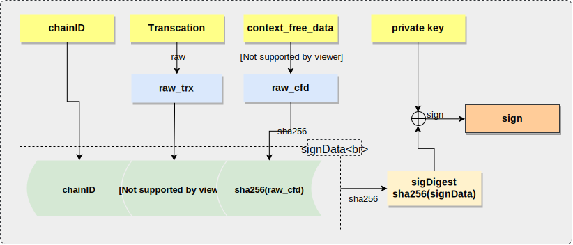

# eosforce 客户端开发指南

这里我们主要介绍开发eosforce客户端程序所需的知识。

我们使用 https://github.com/fanyang1988/eosc 作为例子，这个Fork自 https://github.com/eoscanada/eosc，
主要是针对eosforce与eos的不同之处做了一些修改，目前虽然尚未开发完毕，不过作为例子还是够了。

之所以选择以这个项目作为例子是因为这个项目基于go开发，代码比较简洁直接，减少不同语言语法特性造成的疑问。

## 1. 准备：测试环境搭建

为了更直观的理解请求的过程，我们先搭建一条测试链。

可以参照 [测试网搭建说明](zh-cn/eosforce_bios.md) 来搭建一条测试链，

之后我们可以使用eosc测试一下。首先，获取项目并编译：

```shell
go get -v -u https://github.com/fanyang1988/eosc
cd $GOPATH/src/github.com/fanyang1988/eosc/eosc/
go get -v -u ./...
go build
```

我们可以获取区块链信息，这里 节点配置http api url为 http://127.0.0.1:8890

```shell
./eosc -u "http://127.0.0.1:8890" get info
```

成功会显示如下：

```json
{
  "server_version": "1ee63f44",
  "chain_id": "c35dad0f681992a2fda833946b8fae69c790e184a34547faecd12483ac5e4a7f",
  "head_block_num": 3694,
  "last_irreversible_block_num": 3663,
  "last_irreversible_block_id": "00000e4fc0954e6aa6bcb623c2d666a8dc44aba7ab948fb7229dd2a6e7e00a2b",
  "head_block_id": "00000e6e77a8fbde1a17825654857ab1f6815a3ec20636c654e490d4d0cbdf98",
  "head_block_time": "2018-08-02T09:34:21",
  "head_block_producer": "biosbpw",
  "virtual_block_cpu_limit": 40219980,
  "virtual_block_net_limit": 42174687,
  "block_cpu_limit": 999900,
  "block_net_limit": 1048576
}
```

具体eosc功能可以通过 --help 来获得。使用 -d 可以使用debug模式，会显示具体的请求过程，以供参考。

!> 注意 因为eosc开发尚不完善，所以只有部分合约可以使用。

## 2. 基本http API

参见 [链相关api](zh-cn/eosforce_http_chain_api.md) 和 [历史记录api](zh-cn/eosforce_http_history_api.md)

## 3. 交易

对于客户端提交交易（push transcation）是最主要的操作，eosforce对transcation作出了一些修改，
在transcation结构中增加了fee字段表示手续费。

这里我们用transfer交易举例.
先来看一下请求内容，使用eosc发起一次交易：

```shell
./eosc -u "http://127.0.0.1:8890" transfer eosforce biosbpa "1.0" -d
```

成功返回如下：

```shell
-------------------------------
POST /v1/chain/get_info HTTP/1.1
Host: 127.0.0.1:8888


RESPONSE:
{"server_version":"1ee63f44","chain_id":"c35dad0f681992a2fda833946b8fae69c790e184a34547faecd12483ac5e4a7f","head_block_num":4064,"last_irreversible_block_num":4033,"last_irreversible_block_id":"00000fc137507aeb99fcd650e41f98db22c1c47a771c18a7acd82731acd9055b","head_block_id":"00000fe0fa5399e4735cba1c29723659d20dd0ee771167f871dffc80c5a2566f","head_block_time":"2018-08-02T09:52:51","head_block_producer":"biosbpb","virtual_block_cpu_limit":58238411,"virtual_block_net_limit":61068837,"block_cpu_limit":999900,"block_net_limit":1048576}

Enter passphrase to decrypt your vault: 
-------------------------------
POST /v1/chain/get_required_keys HTTP/1.1
Host: 127.0.0.1:8888

{"available_keys":["EOS5f1LvAZwaxL5Yh5tmnEzqRG3WhzDo8728T5D3u9qPLfxUA21gX","EOS58rYRLLamEkAPXjX5fmPSV9ieS4HDdbVNRKpdvGvWBEpWyHqqR","EOS6ZYCrPeK7ksQi8348ULkGvyyJBFeFYdEjtqCKicu3YvxHaJWLi","EOS5AGE9gafVbgoyke3fLSPYHqznXTsKMcKXKkqD4mFjoNW9RioGN"],"transaction":{"expiration":"2018-08-02T09:53:23","ref_block_num":4064,"ref_block_prefix":481975411,"max_net_usage_words":0,"max_cpu_usage_ms":0,"delay_sec":0,"context_free_actions":[],"actions":[{"account":"eosio","name":"transfer","authorization":[{"actor":"eosforce","permission":"active"}],"data":"0000000a5dba3055000000c0d483a93b102700000000000004454f530000000000"}],"transaction_extensions":[],"fee":"0.0100 EOS"}}

RESPONSE:
{"required_keys":["EOS5AGE9gafVbgoyke3fLSPYHqznXTsKMcKXKkqD4mFjoNW9RioGN"]}

{
  "expiration": "2018-08-02T09:53:23",
  "ref_block_num": 4064,
  "ref_block_prefix": 481975411,
  "max_net_usage_words": 0,
  "max_cpu_usage_ms": 0,
  "delay_sec": 0,
  "context_free_actions": [],
  "actions": [
    {
      "account": "eosio",
      "name": "transfer",
      "authorization": [
        {
          "actor": "eosforce",
          "permission": "active"
        }
      ],
      "data": {
        "from": "eosforce",
        "to": "biosbpa",
        "quantity": "1.0000 EOS",
        "memo": ""
      }
    }
  ],
  "transaction_extensions": [],
  "fee": "0.0100 EOS",
  "signatures": [
    "SIG_K1_KjLgCMT5xVmtFzAZhVg7FJyYypChxxshgr9trjJrce4fWkY7r2S7CztEepFtknyxucojTCUZMXny1o6FcnysvZjHri6PH8"
  ],
  "context_free_data": []
}
---
Above is a pretty-printed representation of the outputted file
-------------------------------
POST /v1/chain/push_transaction HTTP/1.1
Host: 127.0.0.1:8888

{"signatures":["SIG_K1_KjLgCMT5xVmtFzAZhVg7FJyYypChxxshgr9trjJrce4fWkY7r2S7CztEepFtknyxucojTCUZMXny1o6FcnysvZjHri6PH8"],"compression":"none","packed_context_free_data":"","packed_trx":"93d4625be00f735cba1c00000000010000000000ea3055000000572d3ccdcd010000000a5dba305500000000a8ed3232210000000a5dba3055000000c0d483a93b102700000000000004454f53000000000000640000000000000004454f5300000000"}

RESPONSE:
{"transaction_id":"0125cd2d97d587408a9b993c80d9dc89a50931073a21e913d7692ca924f066eb","processed":{"id":"0125cd2d97d587408a9b993c80d9dc89a50931073a21e913d7692ca924f066eb","receipt":{"status":"executed","cpu_usage_us":472,"net_usage_words":18},"elapsed":472,"net_usage":144,"scheduled":false,"action_traces":[{"receipt":{"receiver":"eosio","act_digest":"cb6859fa07f7524820bc6d503d2063abb6f66dae65e348f43305719193dc4c90","global_sequence":4078,"recv_sequence":4078,"auth_sequence":[["eosforce",15]],"code_sequence":1,"abi_sequence":1},"act":{"account":"eosio","name":"transfer","authorization":[{"actor":"eosforce","permission":"active"}],"data":{"from":"eosforce","to":"biosbpa","quantity":"1.0000 EOS","memo":""},"hex_data":"0000000a5dba3055000000c0d483a93b102700000000000004454f530000000000"},"elapsed":114,"cpu_usage":0,"console":"","total_cpu_usage":0,"trx_id":"0125cd2d97d587408a9b993c80d9dc89a50931073a21e913d7692ca924f066eb","inline_traces":[]}],"except":null}}

Transaction submitted to the network. Transaction ID: 0125cd2d97d587408a9b993c80d9dc89a50931073a21e913d7692ca924f066eb

```

以下我们分步来看执行了什么：

首先客户端会先获取一下区块信息, 通过 /v1/chain/get_info api执行。

```shell
POST /v1/chain/get_info HTTP/1.1
Host: 127.0.0.1:8888

RESPONSE:
{"server_version":"1ee63f44","chain_id":"c35dad0f681992a2fda833946b8fae69c790e184a34547faecd12483ac5e4a7f","head_block_num":4064,"last_irreversible_block_num":4033,"last_irreversible_block_id":"00000fc137507aeb99fcd650e41f98db22c1c47a771c18a7acd82731acd9055b","head_block_id":"00000fe0fa5399e4735cba1c29723659d20dd0ee771167f871dffc80c5a2566f","head_block_time":"2018-08-02T09:52:51","head_block_producer":"biosbpb","virtual_block_cpu_limit":58238411,"virtual_block_net_limit":61068837,"block_cpu_limit":999900,"block_net_limit":1048576}

```

之后是验证密码，验证密码结束之后构建一个trans结构来请求 /v1/chain/get_required_keys api获取需要的key，这里可以客户端先验证一下是否拥有需要的权限：

```shell
POST /v1/chain/get_required_keys HTTP/1.1
Host: 127.0.0.1:8888

{"available_keys":["EOS5f1LvAZwaxL5Yh5tmnEzqRG3WhzDo8728T5D3u9qPLfxUA21gX","EOS58rYRLLamEkAPXjX5fmPSV9ieS4HDdbVNRKpdvGvWBEpWyHqqR","EOS6ZYCrPeK7ksQi8348ULkGvyyJBFeFYdEjtqCKicu3YvxHaJWLi","EOS5AGE9gafVbgoyke3fLSPYHqznXTsKMcKXKkqD4mFjoNW9RioGN"],"transaction":{"expiration":"2018-08-02T09:53:23","ref_block_num":4064,"ref_block_prefix":481975411,"max_net_usage_words":0,"max_cpu_usage_ms":0,"delay_sec":0,"context_free_actions":[],"actions":[{"account":"eosio","name":"transfer","authorization":[{"actor":"eosforce","permission":"active"}],"data":"0000000a5dba3055000000c0d483a93b102700000000000004454f530000000000"}],"transaction_extensions":[],"fee":"0.0100 EOS"}}

RESPONSE:
{"required_keys":["EOS5AGE9gafVbgoyke3fLSPYHqznXTsKMcKXKkqD4mFjoNW9RioGN"]}
```

之后会构建要发送的交易内容并签名：

```json
{
  "expiration": "2018-08-02T09:53:23",
  "ref_block_num": 4064,
  "ref_block_prefix": 481975411,
  "max_net_usage_words": 0,
  "max_cpu_usage_ms": 0,
  "delay_sec": 0,
  "context_free_actions": [],
  "actions": [
    {
      "account": "eosio",
      "name": "transfer",
      "authorization": [
        {
          "actor": "eosforce",
          "permission": "active"
        }
      ],
      "data": {
        "from": "eosforce",
        "to": "biosbpa",
        "quantity": "1.0000 EOS",
        "memo": ""
      }
    }
  ],
  "transaction_extensions": [],
  "fee": "0.0100 EOS",
  "signatures": [
    "SIG_K1_KjLgCMT5xVmtFzAZhVg7FJyYypChxxshgr9trjJrce4fWkY7r2S7CztEepFtknyxucojTCUZMXny1o6FcnysvZjHri6PH8"
  ],
  "context_free_data": []
}
```

要注意的是eosforce中需要的fee字段，后面我们会详细介绍。

最后发送请求：

```shell
POST /v1/chain/push_transaction HTTP/1.1
Host: 127.0.0.1:8888

{"signatures":["SIG_K1_KjLgCMT5xVmtFzAZhVg7FJyYypChxxshgr9trjJrce4fWkY7r2S7CztEepFtknyxucojTCUZMXny1o6FcnysvZjHri6PH8"],"compression":"none","packed_context_free_data":"","packed_trx":"93d4625be00f735cba1c00000000010000000000ea3055000000572d3ccdcd010000000a5dba305500000000a8ed3232210000000a5dba3055000000c0d483a93b102700000000000004454f53000000000000640000000000000004454f5300000000"}

RESPONSE:
{"transaction_id":"0125cd2d97d587408a9b993c80d9dc89a50931073a21e913d7692ca924f066eb","processed":{"id":"0125cd2d97d587408a9b993c80d9dc89a50931073a21e913d7692ca924f066eb","receipt":{"status":"executed","cpu_usage_us":472,"net_usage_words":18},"elapsed":472,"net_usage":144,"scheduled":false,"action_traces":[{"receipt":{"receiver":"eosio","act_digest":"cb6859fa07f7524820bc6d503d2063abb6f66dae65e348f43305719193dc4c90","global_sequence":4078,"recv_sequence":4078,"auth_sequence":[["eosforce",15]],"code_sequence":1,"abi_sequence":1},"act":{"account":"eosio","name":"transfer","authorization":[{"actor":"eosforce","permission":"active"}],"data":{"from":"eosforce","to":"biosbpa","quantity":"1.0000 EOS","memo":""},"hex_data":"0000000a5dba3055000000c0d483a93b102700000000000004454f530000000000"},"elapsed":114,"cpu_usage":0,"console":"","total_cpu_usage":0,"trx_id":"0125cd2d97d587408a9b993c80d9dc89a50931073a21e913d7692ca924f066eb","inline_traces":[]}],"except":null}}
```

成功则得到返回：

```shell
Transaction submitted to the network. Transaction ID: 0125cd2d97d587408a9b993c80d9dc89a50931073a21e913d7692ca924f066eb
```

!> 注意这里只是提交到EOS网络，并没有确认执行

下面我们通过分析代码详细分析一下交易流程，注意，这里的代码中去除了不重要的逻辑：

### 3.1 **构建交易内容**

首先需要构建交易：

在 [transfer](https://github.com/fanyang1988/eosc/blob/master/eosc/cmd/transfer.go#L12)中：

```go
func(cmd *cobra.Command, args []string) {
    // 根据参数解析命令
    from := toAccount(args[0], "from")
    to := toAccount(args[1], "to")
    quantity, err := eos.NewEOSAssetFromString(args[2])
    errorCheck("invalid amount", err)
    memo := viper.GetString("transfer-cmd-memo")

    api := getAPI()

    // 构建action
    action := eosforce.NewTransfer(from, to, quantity, memo)

    // 注意， eosforce的transfer合约的account是 eosio
    action.Account = eos.AN("eosio")

    // push action
    pushEOSCActions(api, action)
}
```

[NewTransfer](https://github.com/fanyang1988/eos-go/blob/master/eosforce/transfer.go#L6) 中构建 action:

```go
// NewTransfer 根据参数生成一个 transfer Action
func NewTransfer(from, to eos.AccountName, quantity eos.Asset, memo string) *eos.Action {
    return &eos.Action{
        Account: AN("eosio"), // 合约的account名
        Name:    ActN("transfer"), // 合约名
        Authorization: []eos.PermissionLevel{
            {Actor: from, Permission: PN("active")}, // 执行交易所需的权限列表
        },

        // Action参数，根据不同的合约而不同
        ActionData: eos.NewActionData(Transfer{
            From:     from, // 发送者
            To:       to, // 接受者
            Quantity: quantity, // Assert数量
            Memo:     memo, // 注释
        }),
    }
}
```

具体合约的参数可以参考 TODO文档。

构建好action之后，就通过[pushEOSCActions](https://github.com/fanyang1988/eosc/blob/master/eosc/cmd/common.go#L106)函数发送交易.

**构建Transaction** 第二步通过action构建Transaction。

在eos-go的[NewTransaction](https://github.com/fanyang1988/eos-go/blob/master/transaction.go#L42)中构建：

```go
func NewTransaction(actions []*Action, opts *TxOptions) *Transaction {
  if opts == nil {
    opts = &TxOptions{}
  }

  tx := &Transaction{
    Actions: actions,
    Fee: Asset{
      0,
      EOSSymbol,
    },
  }
  tx.Fill(opts.HeadBlockID, opts.DelaySecs, opts.MaxNetUsageWords, opts.MaxCPUUsageMS)
  return tx
}
```

注意Transaction的结构：

```go
type TransactionHeader struct {
  Expiration     JSONTime `json:"expiration"`
  RefBlockNum    uint16   `json:"ref_block_num"`
  RefBlockPrefix uint32   `json:"ref_block_prefix"`

  MaxNetUsageWords Varuint32 `json:"max_net_usage_words"`
  MaxCPUUsageMS    uint8     `json:"max_cpu_usage_ms"`
  DelaySec         Varuint32 `json:"delay_sec"` // number of secs to delay, making it cancellable for that duration
}

type Transaction struct { // WARN: is a `variant` in C++, can be a SignedTransaction or a Transaction.
  TransactionHeader

  ContextFreeActions []*Action    `json:"context_free_actions"`
  Actions            []*Action    `json:"actions"`
  Extensions         []*Extension `json:"transaction_extensions"`
  Fee                Asset        `json:"fee"`
}
```

!> 这里要特别注意 Fee， 这个是eosforce与eos不同的地方，客户端需要根据action不同添加正确的fee， 如果这里fee不正确，会出现 `trx->trx.fee == txfee.get_required_fee(trx->trx)`错误

!> 另外一个需要注意的是eosforce强制一个transcation中只能有一个action，所以Actions项中只能有一项。

完整的Transcation如下：

```json
{
  "expiration": "2018-08-02T09:53:23",
  "ref_block_num": 4064,
  "ref_block_prefix": 481975411,
  "max_net_usage_words": 0,
  "max_cpu_usage_ms": 0,
  "delay_sec": 0,
  "context_free_actions": [],
  "actions": [
    {
      "account": "eosio",
      "name": "transfer",
      "authorization": [
        {
          "actor": "eosforce",
          "permission": "active"
        }
      ],
      "data": {
        "from": "eosforce",
        "to": "biosbpa",
        "quantity": "1.0000 EOS",
        "memo": ""
      }
    }
  ],
  "transaction_extensions": [],
  "fee": "0.0100 EOS",
  "signatures": [
    "SIG_K1_KjLgCMT5xVmtFzAZhVg7FJyYypChxxshgr9trjJrce4fWkY7r2S7CztEepFtknyxucojTCUZMXny1o6FcnysvZjHri6PH8"
  ],
  "context_free_data": []
}
```

### 3.2 **签名Transaction** 

第三步利用Trans，chanID和key获得SignedTransaction。

签名逻辑在 [SignTransaction](https://github.com/fanyang1988/eos-go/blob/master/api.go#L240) 中。

注意[SignedTransaction](https://github.com/fanyang1988/eos-go/blob/master/transaction.go#L90)的结构：

```go
type SignedTransaction struct {
  *Transaction // SignedTransaction包括所有

  Signatures      []ecc.Signature `json:"signatures"`
  ContextFreeData []HexBytes      `json:"context_free_data"`

  packed *PackedTransaction
}
```

首先获得所有需要权限的签名：

```go
resp, err := api.GetRequiredKeys(tx)
if err != nil {
  return nil, nil, fmt.Errorf("get_required_keys: %s", err)
}
requiredKeys = resp.RequiredKeys
```

签名[Sign](https://github.com/fanyang1988/eos-go/blob/master/api.go#L262)：

先将Transaction和ContextFreeData打包：

```go
// PackedTransactionAndCFD 将Transaction和ContextFreeData打包成二进制
func (s *SignedTransaction) PackedTransactionAndCFD() ([]byte, []byte, error) {
  rawtrx, err := MarshalBinary(s.Transaction)
  if err != nil {
    return nil, nil, err
  }

  rawcfd := []byte{}
  if len(s.ContextFreeData) > 0 {
    rawcfd, err = MarshalBinary(s.ContextFreeData)
    if err != nil {
      return nil, nil, err
    }
  }

  return rawtrx, rawcfd, nil
}
```

根据返回的rawtrx和rawcfd生成一个签名：

```go
// sigDigest := SigDigest(chainID, txdata, cfd)
func SigDigest(chainID, payload, contextFreeData []byte) []byte {
  h := sha256.New()
  if len(chainID) == 0 {
    _, _ = h.Write(make([]byte, 32, 32))
  } else {
    _, _ = h.Write(chainID)
  }
  _, _ = h.Write(payload)

  if len(contextFreeData) > 0 {
    h2 := sha256.New()
    _, _ = h2.Write(contextFreeData)
    _, _ = h.Write(h2.Sum(nil)) // add the hash of CFD to the payload
  } else {
    _, _ = h.Write(make([]byte, 32, 32))
  }
  return h.Sum(nil)
}
```

之后用上一步生成的sigDigest签名：

```go
  keyMap := b.keyMap()
  for _, key := range requiredKeys {
    privKey := keyMap[key.String()]
    if privKey == nil {
      return nil, fmt.Errorf("private key for %q not in keybag", key)
    }

    // fmt.Println("Signing with", key.String(), privKey.String())
    // fmt.Println("SIGNING THIS DIGEST:", hex.EncodeToString(sigDigest))
    // fmt.Println("SIGNING THIS payload:", hex.EncodeToString(txdata))
    // fmt.Println("SIGNING THIS chainID:", hex.EncodeToString(chainID))
    // fmt.Println("SIGNING THIS cfd:", hex.EncodeToString(cfd))
    sig, err := privKey.Sign(sigDigest)
    if err != nil {
      return nil, err
    }

    tx.Signatures = append(tx.Signatures, sig)
  }
```

这里用需要的权限将sigDigest分别签名，结果在Signatures中。

以上的签名过程可以总结成下图：



这样我们得到了SignedTransaction，下一步就是将其打包成PackedTransaction。

### 3.3 **打包Transaction** 

第四步是将SignedTransaction打包进PackedTransaction。

打包在[Pack](https://github.com/fanyang1988/eos-go/blob/master/transaction.go#L155)中：

```go
// SignedTransaction打包逻辑
func (s *SignedTransaction) Pack(compression CompressionType) (*PackedTransaction, error) {
  // 这里和之前签名一样，获取Transaction和ContextFreeData的二进制
  rawtrx, rawcfd, err := s.PackedTransactionAndCFD() 
  if err != nil {
    return nil, err
  }

  // 这里可以选择压缩方式
  switch compression {
  case CompressionZlib:
    var trx bytes.Buffer
    var cfd bytes.Buffer

    // 以下分别压缩Transaction和ContextFreeData的二进制
    // Compress Trx
    writer, _ := zlib.NewWriterLevel(&trx, flate.BestCompression) // can only fail if invalid `level`..
    writer.Write(rawtrx)                                          // ignore error, could only bust memory
    err = writer.Close()
    if err != nil {
      return nil, fmt.Errorf("tx writer close %s", err)
    }
    rawtrx = trx.Bytes()

    // Compress ContextFreeData
    writer, _ = zlib.NewWriterLevel(&cfd, flate.BestCompression) // can only fail if invalid `level`..
    writer.Write(rawcfd)                                         // ignore errors, memory errors only
    err = writer.Close()
    if err != nil {
      return nil, fmt.Errorf("cfd writer close %s", err)
    }
    rawcfd = cfd.Bytes()

  }
  
  // 上面处理好rawcfd和rawtrx， 将其和之前Signatures签名一起构建PackedTransaction
  packed := &PackedTransaction{
    Signatures:            s.Signatures,
    Compression:           compression,
    PackedContextFreeData: rawcfd,
    PackedTransaction:     rawtrx,
  }

  return packed, nil
}
```

如代码所示最终构建出PackedTransaction：

```go
// PackedTransaction represents a fully packed transaction, with
// signatures, and all. They circulate like that on the P2P net, and
// that's how they are stored.
type PackedTransaction struct {
  Signatures            []ecc.Signature `json:"signatures"`
  Compression           CompressionType `json:"compression"` // in C++, it's an enum, not sure how it Binary-marshals..
  PackedContextFreeData HexBytes        `json:"packed_context_free_data"`
  PackedTransaction     HexBytes        `json:"packed_trx"`
}
```

### 3.4 **发送Transaction**

最后发送PackedTransaction到节点。

上面构建好的在[api.PushTransaction](https://github.com/fanyang1988/eosc/blob/master/eosc/cmd/common.go#L183)发送：

```go
// PushTransaction submits a properly filled (tapos), packed and
// signed transaction to the blockchain.
func (api *API) PushTransaction(tx *PackedTransaction) (out *PushTransactionFullResp, err error) {
  err = api.call("chain", "push_transaction", tx, &out)
  return
}
```

这里通过http api发送push 请求：

```shell
POST /v1/chain/push_transaction HTTP/1.1
Host: 127.0.0.1:8888

{"signatures":["SIG_K1_KjLgCMT5xVmtFzAZhVg7FJyYypChxxshgr9trjJrce4fWkY7r2S7CztEepFtknyxucojTCUZMXny1o6FcnysvZjHri6PH8"],"compression":"none","packed_context_free_data":"","packed_trx":"93d4625be00f735cba1c00000000010000000000ea3055000000572d3ccdcd010000000a5dba305500000000a8ed3232210000000a5dba3055000000c0d483a93b102700000000000004454f53000000000000640000000000000004454f5300000000"}
```

由此我们就完成了整个过程。

以上就是整个打包过程。

!> 这里要特别注意一个问题:

### 3.5 关于打包的问题（**需要注意！！！**）

很多实现中会通过节点提供的 json_to_bin 来打包action的data，这里我们分析一下cleos的实现：

注意其create_action函数：

```cpp
chain::action create_action(const vector<permission_level>& authorization, const account_name& code, const action_name& act, const fc::variant& args) {
   auto arg = fc::mutable_variant_object()
      ("code", code)
      ("action", act)
      ("args", args);

   auto result = call(json_to_bin_func, arg);
   wdump((result)(arg));
   return chain::action{authorization, code, act, result.get_object()["binargs"].as<bytes>()};
}
```

这里使用json_to_bin api可以根据合约将合约数据打成二进制包，为了匹配所有类型的合约，这个过程在节点中实现，
这里需要注意的是，节点的api会根据合约名进行筛选，所以如果一个action的name没有在合约名列表中，则请求会被驳回。

这里eosforce删去了很多原有的合约，保留的合约不会有问题，但是eos实现中有一部分action属于内置合约，即在C++层执行逻辑，如下：

```cpp
   /**
    * @defgroup native_action_handlers Native Action Handlers
    */
   ///@{
   void apply_eosio_newaccount(apply_context&);
   void apply_eosio_updateauth(apply_context&);
   void apply_eosio_deleteauth(apply_context&);
   void apply_eosio_linkauth(apply_context&);
   void apply_eosio_unlinkauth(apply_context&);

   ...
```

这里需要注意的就是newaccount，这个action可以执行，但没有在合约列表中，所以以newaccount调用json_to_bin会出错。

这是eosforce目前的一个问题，后续我们会加回合约声明，目前开发者可以选择去调用emlg主网的节点提供的api，也可以在客户端自行打包。

## 4. p2p节点

?> TODO p2p节点部署开发介绍